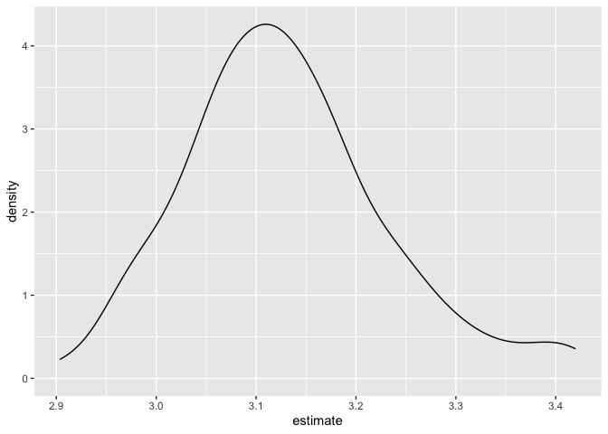
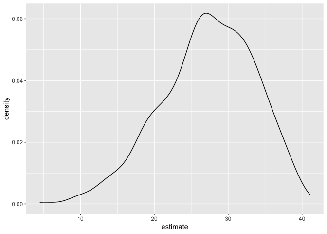

The bootstrap
================
Yuki Joyama
2023-11-14

``` r
library(tidyverse)
```

    ## ── Attaching core tidyverse packages ──────────────────────── tidyverse 2.0.0 ──
    ## ✔ dplyr     1.1.3     ✔ readr     2.1.4
    ## ✔ forcats   1.0.0     ✔ stringr   1.5.0
    ## ✔ ggplot2   3.4.3     ✔ tibble    3.2.1
    ## ✔ lubridate 1.9.2     ✔ tidyr     1.3.0
    ## ✔ purrr     1.0.2     
    ## ── Conflicts ────────────────────────────────────────── tidyverse_conflicts() ──
    ## ✖ dplyr::filter() masks stats::filter()
    ## ✖ dplyr::lag()    masks stats::lag()
    ## ℹ Use the conflicted package (<http://conflicted.r-lib.org/>) to force all conflicts to become errors

``` r
library(modelr)
library(p8105.datasets)
set.seed(1)
```

## Generate a relevant example

``` r
n_samp = 250

sim_df_const = 
  tibble(
    x = rnorm(n_samp, 1, 1),
    error = rnorm(n_samp, 0, 1),
    y = 2 + 3 * x + error
  )

sim_df_nonconst = 
  sim_df_const |> 
  mutate(
    error = error * 0.75 * x,
    y = 2 + 3 * x + error 
  )

sim_df_const |> 
  ggplot(aes(x = x, y = y)) + geom_point()
```

<!-- -->

``` r
sim_df_nonconst |> 
  ggplot(aes(x = x, y = y)) + geom_point()
```

<!-- -->

fit some linear models

``` r
sim_df_nonconst |> 
  lm(y ~ x, data = _) |> 
  broom::tidy()
```

    ## # A tibble: 2 × 5
    ##   term        estimate std.error statistic   p.value
    ##   <chr>          <dbl>     <dbl>     <dbl>     <dbl>
    ## 1 (Intercept)     1.93    0.105       18.5 1.88e- 48
    ## 2 x               3.11    0.0747      41.7 5.76e-114

## Draw and analyze a bootstrap sample

Start with a lil function

``` r
boot_sample = function(df) {
  
  sample_frac(df, replace = TRUE)
  
}
```

Let’s see how this works

``` r
sim_df_nonconst |> 
  boot_sample() |> 
  ggplot(aes(x = x, y = y)) + 
  geom_point(alpha = .5) + 
  stat_smooth(method = "lm")
```

    ## `geom_smooth()` using formula = 'y ~ x'

<!-- -->

### Draw a lot of samples and analyze them

``` r
boot_straps =
  tibble(strap_number = 1:100) |> 
  mutate(
    strap_sample = map(strap_number, \(i) boot_sample(sim_df_nonconst))
  )

boot_straps |> 
  pull(strap_sample) |> 
  nth(2) |> 
  arrange(x)
```

    ## # A tibble: 250 × 3
    ##         x  error       y
    ##     <dbl>  <dbl>   <dbl>
    ##  1 -1.29   1.40  -0.454 
    ##  2 -0.989 -1.97  -2.93  
    ##  3 -0.914 -0.908 -1.65  
    ##  4 -0.914 -0.908 -1.65  
    ##  5 -0.805  0.292 -0.123 
    ##  6 -0.805  0.292 -0.123 
    ##  7 -0.665 -0.544 -0.539 
    ##  8 -0.641 -0.416 -0.338 
    ##  9 -0.606 -0.106  0.0774
    ## 10 -0.606 -0.106  0.0774
    ## # ℹ 240 more rows

Now do the `lm` fit.

``` r
boot_results = 
  boot_straps |> 
  mutate(
    models = map(strap_sample, \(df) lm(y ~ x, data = df)),
    results = map(models, broom::tidy)
  ) |> 
  select(strap_number, results) |> 
  unnest(results)
```

try to summarize these results – get a bootstrap SE

``` r
boot_results |> 
  group_by(term) |> 
  summarize(
    se = sd(estimate) # smaller se for intercept, and larger se for slope
  )
```

    ## # A tibble: 2 × 2
    ##   term            se
    ##   <chr>        <dbl>
    ## 1 (Intercept) 0.0752
    ## 2 x           0.102

``` r
sim_df_nonconst |> 
  lm(y ~ x, data = _) |> 
  broom::tidy()
```

    ## # A tibble: 2 × 5
    ##   term        estimate std.error statistic   p.value
    ##   <chr>          <dbl>     <dbl>     <dbl>     <dbl>
    ## 1 (Intercept)     1.93    0.105       18.5 1.88e- 48
    ## 2 x               3.11    0.0747      41.7 5.76e-114

Look at the distribution.

``` r
boot_results |> 
  filter(term == "x") |> 
  ggplot(aes(x = estimate)) +
  geom_density()
```

<!-- -->

Can I construct a CI

``` r
boot_results |> 
  group_by(term) |> 
  summarize(
    ci_lower = quantile(estimate, 0.025),
    ci_upper = quantile(estimate, 0.975)
  )
```

    ## # A tibble: 2 × 3
    ##   term        ci_lower ci_upper
    ##   <chr>          <dbl>    <dbl>
    ## 1 (Intercept)     1.76     2.06
    ## 2 x               2.97     3.38

## Airbnb

``` r
data("nyc_airbnb")

nyc_airbnb = 
  nyc_airbnb |> 
  mutate(stars = review_scores_location / 2) |> 
  rename(
    borough = neighbourhood_group,
    neighborhood = neighbourhood) |> 
  filter(borough != "Staten Island") |> 
  drop_na(price, stars) |> 
  select(price, stars, borough, neighborhood, room_type)
```

Let’s fit a regression of `price` on other variables and look at
residuals

``` r
airbnb_fit = 
  nyc_airbnb |> 
    lm(price ~ stars + room_type + borough, data = _)
```

Residuals

``` r
nyc_airbnb |> 
  modelr::add_residuals(airbnb_fit) |> 
  ggplot(aes(x = stars, y = resid)) +
  geom_point()
```

<!-- -->

run a boostrap on this whole thing to get estimates for the effect of
`stars` on `price`

``` r
manhattan_df = 
  nyc_airbnb |> 
  filter(borough == "Manhattan") 

boot_results = 
  tibble(strap_number = 1:1000) |> 
  mutate(
    strap_sample = map(strap_number, \(i) boot_sample(manhattan_df)),
    models = map(strap_sample, \(df) lm(price ~ stars + room_type, data = df)),
    results = map(models, broom::tidy)
  ) |> 
  select(strap_number, results) |> 
  unnest(results)

boot_results |> 
  filter(term == "stars") |> 
  ggplot(aes(x = estimate)) +
  geom_density()
```

<!-- -->
