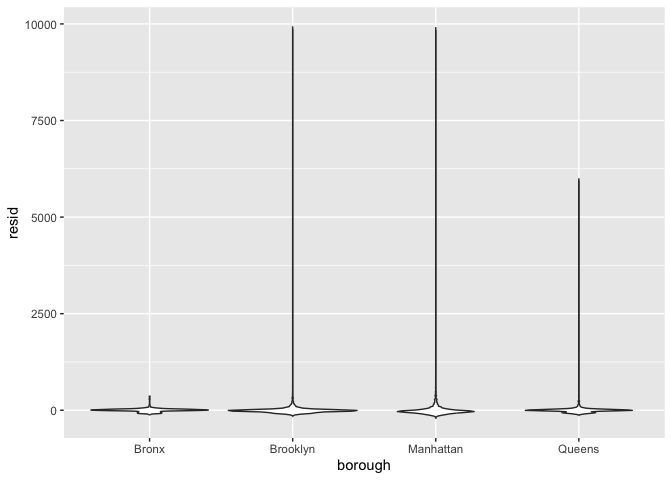

Linear Models
================
Yuki Joyama
2023-11-09

Load key packages

``` r
library(tidyverse)
```

    ## ── Attaching core tidyverse packages ──────────────────────── tidyverse 2.0.0 ──
    ## ✔ dplyr     1.1.3     ✔ readr     2.1.4
    ## ✔ forcats   1.0.0     ✔ stringr   1.5.0
    ## ✔ ggplot2   3.4.3     ✔ tibble    3.2.1
    ## ✔ lubridate 1.9.2     ✔ tidyr     1.3.0
    ## ✔ purrr     1.0.2     
    ## ── Conflicts ────────────────────────────────────────── tidyverse_conflicts() ──
    ## ✖ dplyr::filter() masks stats::filter()
    ## ✖ dplyr::lag()    masks stats::lag()
    ## ℹ Use the conflicted package (<http://conflicted.r-lib.org/>) to force all conflicts to become errors

``` r
library(p8105.datasets)
```

## Load and clean the Airbnb data

``` r
data("nyc_airbnb")

nyc_airbnb = 
  nyc_airbnb |> 
  mutate(stars = review_scores_location /2) |> 
  select(price, stars, borough = neighbourhood_group, neighbourhood, room_type) |> 
  filter(borough != "Staten Island")
```

Let’s fit a model!

``` r
fit = 
  nyc_airbnb |> 
  lm(price ~ stars + borough, data = _)
```

Let’s look at the fit

``` r
fit
```

    ## 
    ## Call:
    ## lm(formula = price ~ stars + borough, data = nyc_airbnb)
    ## 
    ## Coefficients:
    ##      (Intercept)             stars   boroughBrooklyn  boroughManhattan  
    ##           -70.41             31.99             40.50             90.25  
    ##    boroughQueens  
    ##            13.21

``` r
summary(fit)
```

    ## 
    ## Call:
    ## lm(formula = price ~ stars + borough, data = nyc_airbnb)
    ## 
    ## Residuals:
    ##    Min     1Q Median     3Q    Max 
    ## -169.8  -64.0  -29.0   20.2 9870.0 
    ## 
    ## Coefficients:
    ##                  Estimate Std. Error t value Pr(>|t|)    
    ## (Intercept)       -70.414     14.021  -5.022 5.14e-07 ***
    ## stars              31.990      2.527  12.657  < 2e-16 ***
    ## boroughBrooklyn    40.500      8.559   4.732 2.23e-06 ***
    ## boroughManhattan   90.254      8.567  10.534  < 2e-16 ***
    ## boroughQueens      13.206      9.065   1.457    0.145    
    ## ---
    ## Signif. codes:  0 '***' 0.001 '**' 0.01 '*' 0.05 '.' 0.1 ' ' 1
    ## 
    ## Residual standard error: 181.5 on 30525 degrees of freedom
    ##   (9962 observations deleted due to missingness)
    ## Multiple R-squared:  0.03423,    Adjusted R-squared:  0.03411 
    ## F-statistic: 270.5 on 4 and 30525 DF,  p-value: < 2.2e-16

``` r
summary(fit)$coef
```

    ##                   Estimate Std. Error   t value     Pr(>|t|)
    ## (Intercept)      -70.41446  14.020697 -5.022180 5.137589e-07
    ## stars             31.98989   2.527500 12.656733 1.269392e-36
    ## boroughBrooklyn   40.50030   8.558724  4.732049 2.232595e-06
    ## boroughManhattan  90.25393   8.567490 10.534465 6.638618e-26
    ## boroughQueens     13.20617   9.064879  1.456850 1.451682e-01

``` r
coef(fit)
```

    ##      (Intercept)            stars  boroughBrooklyn boroughManhattan 
    ##        -70.41446         31.98989         40.50030         90.25393 
    ##    boroughQueens 
    ##         13.20617

``` r
# fitted.values(fit)
```

tidy up the output instead

``` r
fit |> 
  broom::glance()
```

    ## # A tibble: 1 × 12
    ##   r.squared adj.r.squared sigma statistic   p.value    df   logLik    AIC    BIC
    ##       <dbl>         <dbl> <dbl>     <dbl>     <dbl> <dbl>    <dbl>  <dbl>  <dbl>
    ## 1    0.0342        0.0341  182.      271. 6.73e-229     4 -202113. 4.04e5 4.04e5
    ## # ℹ 3 more variables: deviance <dbl>, df.residual <int>, nobs <int>

tidy up the coefficients

``` r
fit |> 
  broom::tidy() |> # returns tibble instead of matrix
  mutate(term = str_replace(term, "^borough", "Borough: ")) |> 
  select(term, estimate, p.value) |> 
  knitr::kable(digits = 3)
```

| term               | estimate | p.value |
|:-------------------|---------:|--------:|
| (Intercept)        |  -70.414 |   0.000 |
| stars              |   31.990 |   0.000 |
| Borough: Brooklyn  |   40.500 |   0.000 |
| Borough: Manhattan |   90.254 |   0.000 |
| Borough: Queens    |   13.206 |   0.145 |

## Fit another model

``` r
fit = 
  nyc_airbnb |> 
  mutate(
    borough = fct_infreq(borough),
    room_type = fct_infreq(room_type)
  ) |> 
  lm(price ~ stars + borough + room_type, data = _)

fit |> 
  broom::tidy()
```

    ## # A tibble: 7 × 5
    ##   term                  estimate std.error statistic  p.value
    ##   <chr>                    <dbl>     <dbl>     <dbl>    <dbl>
    ## 1 (Intercept)              113.      11.8       9.54 1.56e-21
    ## 2 stars                     21.9      2.43      9.01 2.09e-19
    ## 3 boroughBrooklyn          -40.3      2.15    -18.8  4.62e-78
    ## 4 boroughQueens            -55.5      3.59    -15.4  1.32e-53
    ## 5 boroughBronx             -63.0      8.22     -7.67 1.76e-14
    ## 6 room_typePrivate room   -105.       2.05    -51.2  0       
    ## 7 room_typeShared room    -129.       6.15    -21.0  2.24e-97

## Quick look at diagnostics

``` r
nyc_airbnb |> 
  modelr::add_residuals(fit) |> 
  ggplot(aes(x = borough, y = resid)) +
  geom_violin() 
```

    ## Warning: Removed 9962 rows containing non-finite values (`stat_ydensity()`).

<!-- -->

``` r
nyc_airbnb |> 
  modelr::add_residuals(fit) |> 
  ggplot(aes(x = stars, y = resid)) +
  geom_point() 
```

    ## Warning: Removed 9962 rows containing missing values (`geom_point()`).

<!-- -->

## Hypothesis test for categorical predictor

fit a “null” and “alternative” model

``` r
fit |> 
  broom::tidy()
```

    ## # A tibble: 7 × 5
    ##   term                  estimate std.error statistic  p.value
    ##   <chr>                    <dbl>     <dbl>     <dbl>    <dbl>
    ## 1 (Intercept)              113.      11.8       9.54 1.56e-21
    ## 2 stars                     21.9      2.43      9.01 2.09e-19
    ## 3 boroughBrooklyn          -40.3      2.15    -18.8  4.62e-78
    ## 4 boroughQueens            -55.5      3.59    -15.4  1.32e-53
    ## 5 boroughBronx             -63.0      8.22     -7.67 1.76e-14
    ## 6 room_typePrivate room   -105.       2.05    -51.2  0       
    ## 7 room_typeShared room    -129.       6.15    -21.0  2.24e-97

``` r
fit_null = lm(price ~ stars + borough, data = nyc_airbnb)
fit_alternative = lm(price ~ stars + borough + room_type, data = nyc_airbnb)

anova(fit_null, fit_alternative) |> 
  broom::tidy()
```

    ## # A tibble: 2 × 7
    ##   term                        df.residual    rss    df   sumsq statistic p.value
    ##   <chr>                             <dbl>  <dbl> <dbl>   <dbl>     <dbl>   <dbl>
    ## 1 price ~ stars + borough           30525 1.01e9    NA NA            NA       NA
    ## 2 price ~ stars + borough + …       30523 9.21e8     2  8.42e7     1394.       0

## Borough-level differences

``` r
fit = 
  nyc_airbnb |> 
  lm(price ~ stars * borough + room_type * borough, data = _)

fit |> 
  broom::tidy()
```

    ## # A tibble: 16 × 5
    ##    term                                   estimate std.error statistic   p.value
    ##    <chr>                                     <dbl>     <dbl>     <dbl>     <dbl>
    ##  1 (Intercept)                               90.1       75.4    1.19   0.232    
    ##  2 stars                                      4.45      16.6    0.267  0.789    
    ##  3 boroughBrooklyn                          -20.4       77.1   -0.265  0.791    
    ##  4 boroughManhattan                           5.63      77.8    0.0723 0.942    
    ##  5 boroughQueens                              1.51      83.5    0.0181 0.986    
    ##  6 room_typePrivate room                    -52.9       17.8   -2.98   0.00288  
    ##  7 room_typeShared room                     -70.5       41.6   -1.70   0.0896   
    ##  8 stars:boroughBrooklyn                     16.5       17.0    0.973  0.331    
    ##  9 stars:boroughManhattan                    22.7       17.1    1.33   0.185    
    ## 10 stars:boroughQueens                        5.21      18.3    0.285  0.776    
    ## 11 boroughBrooklyn:room_typePrivate room    -39.3       18.0   -2.18   0.0292   
    ## 12 boroughManhattan:room_typePrivate room   -71.3       18.0   -3.96   0.0000754
    ## 13 boroughQueens:room_typePrivate room      -16.3       19.0   -0.859  0.390    
    ## 14 boroughBrooklyn:room_typeShared room     -35.3       42.9   -0.822  0.411    
    ## 15 boroughManhattan:room_typeShared room    -83.1       42.5   -1.96   0.0503   
    ## 16 boroughQueens:room_typeShared room       -24.4       44.4   -0.550  0.582

``` r
airbnb_lm = function(df){
  lm(price ~ stars + room_type, data = df)
}

nyc_airbnb |> 
  nest(df = -borough) |> 
  mutate(
    models = map(df, airbnb_lm),
    results = map(models, broom::tidy)
  ) |> 
  select(borough, results) |> 
  unnest(results) |> 
  select(borough, term, estimate) |> 
  pivot_wider(
    names_from = term,
    values_from = estimate
  ) |> 
  knitr::kable(digits = 2)
```

| borough   | (Intercept) | stars | room_typePrivate room | room_typeShared room |
|:----------|------------:|------:|----------------------:|---------------------:|
| Bronx     |       90.07 |  4.45 |                -52.91 |               -70.55 |
| Queens    |       91.58 |  9.65 |                -69.26 |               -94.97 |
| Brooklyn  |       69.63 | 20.97 |                -92.22 |              -105.84 |
| Manhattan |       95.69 | 27.11 |               -124.19 |              -153.64 |

same thing but just a little different

``` r
nyc_airbnb |>
  nest(df = -borough) |>
  mutate(
    models = map(df, \(df) lm(price ~ stars + room_type, data = df)), # anonymous function
    results = map(models, broom::tidy)
  ) |>
  select(borough, results) |>
  unnest(results) |>
  select(borough, term, estimate) |>
  pivot_wider(
    names_from = term,
    values_from = estimate
  ) |>
  knitr::kable(digits = 2)
```

| borough   | (Intercept) | stars | room_typePrivate room | room_typeShared room |
|:----------|------------:|------:|----------------------:|---------------------:|
| Bronx     |       90.07 |  4.45 |                -52.91 |               -70.55 |
| Queens    |       91.58 |  9.65 |                -69.26 |               -94.97 |
| Brooklyn  |       69.63 | 20.97 |                -92.22 |              -105.84 |
| Manhattan |       95.69 | 27.11 |               -124.19 |              -153.64 |
